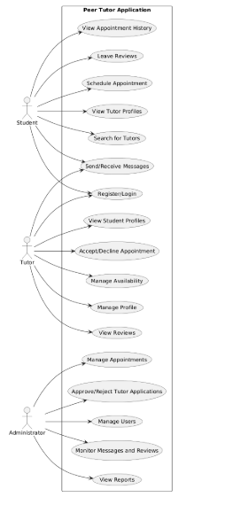

# Peer Tutor Application

## Project Overview
The **Peer Tutor Application** is a web-based platform designed to facilitate online tutoring between students and tutors. It enables students to search for tutors, schedule appointments, communicate via messaging, and leave reviews. The platform supports multiple user roles, including students, tutors, and administrators.

## Technologies Used
- **Frontend:** HTML, CSS, JavaScript, jQuery
- **Backend:** PHP
- **Database:** MySQL

## Project Directory Structure
```
peerTutorApp/
│── assets/
│   ├── css/                     # Stylesheets
│   │   ├── main.css             # Main CSS file
│   │   ├── dashboard.css        # Styles for dashboard
│   │   ├── forms.css            # Styles for forms
│   │   ├── responsive.css       # Mobile responsiveness styles
│   ├── js/                      # JavaScript files
│   │   ├── main.js              # Main JS file
│   │   ├── auth.js              # Handles login/register logic
│   │   ├── search.js            # Search and filtering logic
│   │   ├── appointments.js      # Appointment scheduling logic
│   │   ├── messaging.js         # Chat/messaging logic
│   ├── jquery/                  # jQuery Plugins
│   │   ├── jquery.min.js        # jQuery library
│   │   ├── modal.js             # jQuery plugin for modals
│   │   ├── validation.js        # jQuery form validation
│   ├── images/                  # Images, logos, icons
│
│── config/
│   ├── database.php             # Database connection
│   ├── constants.php            # Global constants
│   ├── session.php              # Session management
│
│── includes/
│   ├── header.php               # Common header file
│   ├── footer.php               # Common footer file
│   ├── navbar.php               # Navigation menu
│   ├── sidebar.php              # Sidebar menu for dashboards
│
│── models/                       # PHP models for database interaction
│   ├── User.php                  # User model (authentication, profile)
│   ├── Tutor.php                 # Tutor-specific methods
│   ├── Student.php               # Student-specific methods
│   ├── Appointment.php           # Appointment scheduling logic
│   ├── Message.php               # Messaging system model
│   ├── Review.php                # Reviews & ratings
│
│── views/                        # Views (Frontend pages)
│   ├── auth/
│   │   ├── login.php             # Login page
│   │   ├── register.php          # Registration page
│   │   ├── forgot-password.php   # Forgot password page
│   ├── dashboard/
│   │   ├── student-dashboard.php # Student's dashboard
│   │   ├── tutor-dashboard.php   # Tutor's dashboard
│   │   ├── admin-dashboard.php   # Admin dashboard
│   ├── appointments/
│   │   ├── schedule.php          # Appointment scheduling page
│   │   ├── view-appointments.php # View all appointments
│   ├── messaging/
│   │   ├── chat.php              # Messaging/chat page
│   ├── profile/
│   │   ├── edit-profile.php      # Edit user profile
│   │   ├── view-profile.php      # View profile
│   ├── reviews/
│   │   ├── give-review.php       # Give a tutor a review
│   │   ├── view-reviews.php      # View all reviews
│   ├── search/
│   │   ├── search-tutors.php     # Search for tutors
│
│── admin/                         # Admin-related files
│   ├── manage-users.php           # Admin user management
│   ├── manage-appointments.php    # Manage tutor-student appointments
│   ├── reports.php                # View reports & analytics
│
│── api/                           # API endpoints for AJAX calls
│   ├── auth.php                   # API for authentication
│   ├── appointments.php           # API for managing appointments
│   ├── messages.php               # API for sending/receiving messages
│   ├── reviews.php                # API for handling reviews
│   ├── search.php                 # API for searching tutors
│
│── database/
│   ├── schema.sql                 # SQL file for database setup
│   ├── seed.sql                   # Sample data for testing
│
│── index.php                      # Main landing page
│── dashboard.php                   # Main dashboard entry
│── .htaccess                       # URL routing settings
│── README.md                       # Documentation
```

## Installation Guide
### Prerequisites
- XAMPP or LAMP for local development
- MySQL database
- PHP 7.4+
- Apache Server

### Steps
1. Clone the repository:
   ```bash
   git clone https://github.com/your-repo/peerTutorApp.git
   ```
2. Move into the project directory:
   ```bash
   cd peerTutorApp
   ```
3. Configure the database:
   - Create a new database in MySQL
   - Import `database/schema.sql`
   - Update `config/database.php` with your database credentials
4. Start the Apache server and MySQL using XAMPP/LAMP.
5. Open the project in a browser:
   ```bash
   http://localhost/peerTutorApp/
   ```

## Features
- **User Authentication**: Register/Login for students and tutors
- **Tutor Search**: Search and filter tutors
- **Appointment Scheduling**: Book, edit, or cancel appointments
- **Messaging System**: Real-time communication between students and tutors
- **Admin Dashboard**: Manage users, track appointments, and generate reports

## Contribution Guidelines
1. Fork the repository
2. Create a new branch:
   ```bash
   git checkout -b feature-branch
   ```
3. Commit your changes:
   ```bash
   git commit -m "Added new feature"
   ```
4. Push to your fork and submit a Pull Request

## Use Case Diagram



## License
This project is licensed under the MIT License.
